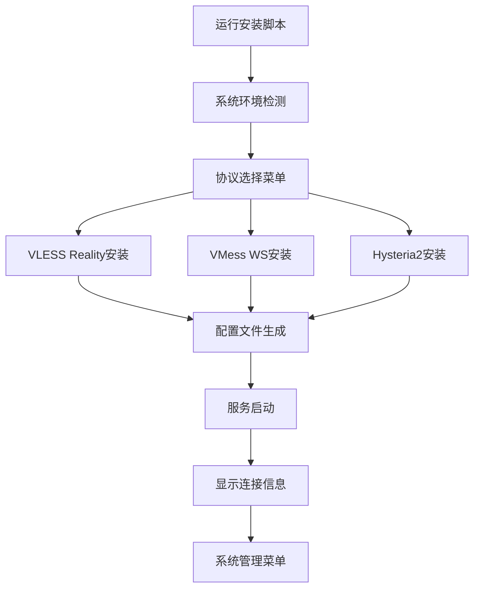

## 1. Product Overview
Sing-box VPS一键安装脚本，支持快速部署vless reality、vmess ws、hy2三种主流代理协议的自动化安装工具。
- 解决VPS代理服务器搭建复杂、配置繁琐的问题，为技术用户提供简单易用的一键部署方案。
- 目标是成为最受欢迎的sing-box部署脚本，简化代理服务器搭建流程。

## 2. Core Features

### 2.1 User Roles
| Role | Registration Method | Core Permissions |
|------|---------------------|------------------|
| VPS管理员 | 直接运行脚本 | 完整的安装、配置、管理权限 |

### 2.2 Feature Module
我们的sing-box安装脚本包含以下主要功能模块：
1. **主菜单页面**：协议选择、系统检测、安装状态显示
2. **安装配置页面**：自动安装sing-box、生成配置文件、启动服务
3. **协议管理页面**：vless reality配置、vmess ws配置、hy2配置
4. **系统管理页面**：服务状态查看、日志查看、端口更改、配置分享、卸载功能

### 2.3 Page Details
| Page Name | Module Name | Feature description |
|-----------|-------------|---------------------|
| 主菜单页面 | 系统检测模块 | 检测操作系统类型、版本、网络环境，验证系统兼容性 |
| 主菜单页面 | 协议选择模块 | 提供vless reality、vmess ws、hy2三种协议选择界面 |
| 主菜单页面 | 状态显示模块 | 显示当前安装状态、服务运行状态、配置信息 |
| 安装配置页面 | 自动安装模块 | 下载最新版sing-box二进制文件、创建系统服务、配置开机自启 |
| 安装配置页面 | 配置生成模块 | 根据选择的协议自动生成对应的配置文件、设置监听端口 |
| 安装配置页面 | 证书管理模块 | 自动申请SSL证书、配置TLS、处理证书续期 |
| 协议管理页面 | VLESS Reality配置 | 配置reality参数、目标网站、私钥公钥生成 |
| 协议管理页面 | VMess WS配置 | 配置websocket路径、UUID生成、伪装网站设置 |
| 协议管理页面 | Hysteria2配置 | 配置hy2端口、密码、混淆参数、带宽限制 |
| 系统管理页面 | 服务管理模块 | 启动停止重启服务、查看服务状态、设置开机自启 |
| 系统管理页面 | 日志查看模块 | 实时查看运行日志、错误日志、连接日志 |
| 系统管理页面 | 端口管理模块 | 修改监听端口、检测端口占用、自动重启服务应用新端口 |
| 系统管理页面 | 配置分享模块 | 生成客户端配置链接、二维码、订阅链接、批量导出 |
| 系统管理页面 | 卸载功能模块 | 完全卸载sing-box、清理配置文件、移除系统服务 |

## 3. Core Process
主要用户操作流程：
1. VPS管理员下载并运行安装脚本
2. 脚本自动检测系统环境和兼容性
3. 用户选择要安装的协议类型（vless reality/vmess ws/hy2）
4. 脚本自动下载sing-box并进行安装配置
5. 根据选择的协议生成对应的配置文件
6. 启动服务并显示连接信息
7. 用户可通过管理菜单进行端口修改、配置分享等后续管理操作

端口更改流程：
1. 进入系统管理菜单选择端口管理
2. 显示当前使用的端口信息
3. 输入新的端口号并验证可用性
4. 自动更新配置文件并重启服务
5. 验证新端口是否正常工作

配置分享流程：
1. 进入系统管理菜单选择配置分享
2. 选择要分享的协议配置
3. 生成客户端配置链接、二维码或订阅链接
4. 提供多种格式的配置导出选项

## 4. User Interface Design
### 4.1 Design Style
- 主色调：蓝色(#2196F3)和绿色(#4CAF50)，辅助色：灰色(#757575)
- 按钮样式：简洁的方形按钮，带有清晰的边框
- 字体：等宽字体，适合终端显示，字号适中便于阅读
- 布局风格：基于文本的菜单式界面，清晰的层级结构
- 图标风格：使用ASCII字符和简单符号，如[✓]、[✗]、[>]等

### 4.2 Page Design Overview
| Page Name | Module Name | UI Elements |
|-----------|-------------|-------------|
| 主菜单页面 | 系统检测模块 | 彩色状态指示器、系统信息表格、进度条显示 |
| 主菜单页面 | 协议选择模块 | 数字选项菜单、协议描述文本、推荐标签 |
| 安装配置页面 | 安装进度模块 | 实时进度条、步骤状态显示、错误提示框 |
| 协议管理页面 | 配置显示模块 | 格式化的配置信息、二维码生成、复制提示 |
| 系统管理页面 | 状态监控模块 | 实时状态刷新、彩色状态指示、操作按钮组 |
| 系统管理页面 | 端口管理模块 | 端口输入框、可用性检测提示、端口冲突警告 |
| 系统管理页面 | 配置分享模块 | 二维码显示区域、配置链接文本框、格式选择菜单 |

### 4.3 Responsiveness
该脚本主要面向服务器终端环境，采用文本界面设计，自适应不同终端窗口大小，支持SSH远程操作。