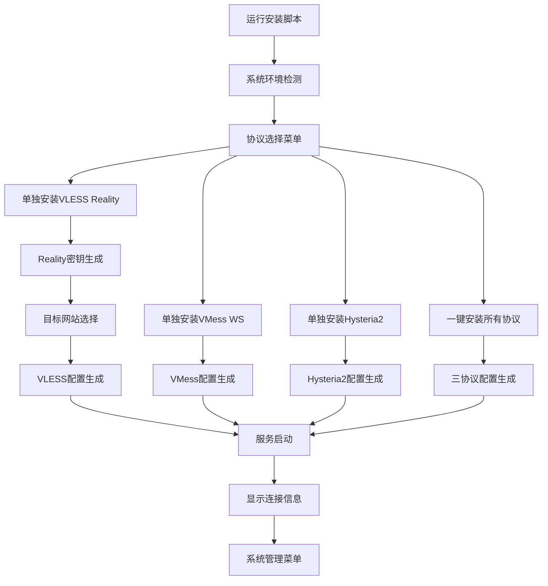

## 1. Product Overview
Sing-box VPS一键安装脚本，支持快速部署vless reality、vmess ws、hy2三种主流代理协议的自动化安装工具。
- 解决VPS代理服务器搭建复杂、配置繁琐的问题，为技术用户提供简单易用的一键部署方案。
- 目标是成为最受欢迎的sing-box部署脚本，简化代理服务器搭建流程。

## 2. Core Features

### 2.1 User Roles
| Role | Registration Method | Core Permissions |
|------|---------------------|------------------|
| VPS管理员 | 直接运行脚本 | 完整的安装、配置、管理权限 |

### 2.2 Feature Module
我们的sing-box安装脚本包含以下主要功能模块：
1. **主菜单页面**：协议选择、系统检测、安装状态显示
2. **安装配置页面**：自动安装sing-box、生成配置文件、启动服务
3. **协议管理页面**：vless reality配置、vmess ws配置、hy2配置
4. **系统管理页面**：服务状态查看、日志查看、端口更改、配置分享、卸载功能
5. **VLESS Reality专用页面**：Reality密钥生成、目标网站配置、单独安装选项

### 2.3 Page Details
| Page Name | Module Name | Feature description |
|-----------|-------------|---------------------|
| 主菜单页面 | 系统检测模块 | 检测操作系统类型、版本、网络环境，验证系统兼容性 |
| 主菜单页面 | 协议选择模块 | 提供vless reality、vmess ws、hy2三种协议选择界面，包含单独安装和一键安装选项 |
| 主菜单页面 | 状态显示模块 | 显示当前安装状态、服务运行状态、配置信息 |
| 安装配置页面 | 自动安装模块 | 下载最新版sing-box二进制文件、创建系统服务、配置开机自启 |
| 安装配置页面 | 配置生成模块 | 根据选择的协议自动生成对应的配置文件、设置监听端口 |
| 安装配置页面 | 证书管理模块 | 自动申请SSL证书、配置TLS、处理证书续期 |
| 协议管理页面 | VLESS Reality配置 | 配置reality参数、目标网站、私钥公钥生成、Short ID生成、Flow控制设置 |
| VLESS Reality专用页面 | Reality密钥生成模块 | 使用sing-box generate reality-keypair生成密钥对 |
| VLESS Reality专用页面 | 目标网站选择模块 | 提供microsoft.com、cloudflare.com等预设选项，支持自定义 |
| VLESS Reality专用页面 | 单独安装模块 | 独立的VLESS Reality安装流程，不依赖其他协议 |
| 协议管理页面 | VMess WS配置 | 配置websocket路径、UUID生成、伪装网站设置 |
| 协议管理页面 | Hysteria2配置 | 配置hy2端口、密码、混淆参数、带宽限制 |
| 系统管理页面 | 服务管理模块 | 启动停止重启服务、查看服务状态、设置开机自启 |
| 系统管理页面 | 日志查看模块 | 实时查看运行日志、错误日志、连接日志 |
| 系统管理页面 | 端口管理模块 | 修改监听端口、检测端口占用、自动重启服务应用新端口 |
| 系统管理页面 | 配置分享模块 | 生成客户端配置链接、二维码、订阅链接、批量导出 |
| 系统管理页面 | 卸载功能模块 | 完全卸载sing-box、清理配置文件、移除系统服务 |

## 3. Core Process
主要用户操作流程：
1. VPS管理员下载并运行安装脚本
2. 脚本自动检测系统环境和兼容性
3. 用户选择要安装的协议类型（单独安装vless reality/单独安装vmess ws/单独安装hy2/一键安装所有协议）
4. 脚本自动下载sing-box并进行安装配置
5. 根据选择的协议生成对应的配置文件
6. 启动服务并显示连接信息
7. 用户可通过管理菜单进行端口修改、配置分享等后续管理操作

VLESS Reality专用安装流程：
1. 选择"单独安装VLESS Reality"选项
2. 系统自动生成Reality密钥对（使用sing-box generate reality-keypair命令）
3. 用户选择目标网站（microsoft.com/cloudflare.com/自定义）
4. 自动生成Short ID（8位十六进制）
5. 配置Flow控制（xtls-rprx-vision）
6. 生成完整的VLESS Reality配置文件
7. 启动服务并显示包含Reality参数的连接信息

端口更改流程：
1. 进入系统管理菜单选择端口管理
2. 显示当前使用的端口信息
3. 输入新的端口号并验证可用性
4. 自动更新配置文件并重启服务
5. 验证新端口是否正常工作

配置分享流程：
1. 进入系统管理菜单选择配置分享
2. 选择要分享的协议配置
3. 生成客户端配置链接、二维码或订阅链接
4. 提供多种格式的配置导出选项



## 4. User Interface Design
### 4.1 Design Style
- 主色调：蓝色(#2196F3)和绿色(#4CAF50)，辅助色：灰色(#757575)
- 按钮样式：简洁的方形按钮，带有清晰的边框
- 字体：等宽字体，适合终端显示，字号适中便于阅读
- 布局风格：基于文本的菜单式界面，清晰的层级结构
- 图标风格：使用ASCII字符和简单符号，如[✓]、[✗]、[>]等

### 4.2 Page Design Overview
| Page Name | Module Name | UI Elements |
|-----------|-------------|-------------|
| 主菜单页面 | 系统检测模块 | 彩色状态指示器、系统信息表格、进度条显示 |
| 主菜单页面 | 协议选择模块 | 数字选项菜单、协议描述文本、推荐标签、单独安装选项 |
| 安装配置页面 | 安装进度模块 | 实时进度条、步骤状态显示、错误提示框 |
| 协议管理页面 | 配置显示模块 | 格式化的配置信息、二维码生成、复制提示 |
| VLESS Reality专用页面 | 密钥生成模块 | Reality密钥对显示、生成进度提示、密钥验证状态 |
| VLESS Reality专用页面 | 目标网站选择 | 预设网站列表、自定义输入框、连通性测试提示 |
| 系统管理页面 | 状态监控模块 | 实时状态刷新、彩色状态指示、操作按钮组 |
| 系统管理页面 | 端口管理模块 | 端口输入框、可用性检测提示、端口冲突警告 |
| 系统管理页面 | 配置分享模块 | 二维码显示区域、配置链接文本框、格式选择菜单 |

### 4.3 Responsiveness
该脚本主要面向服务器终端环境，采用文本界面设计，自适应不同终端窗口大小，支持SSH远程操作。

## 5. 技术实现要求

### 5.1 VLESS Reality协议实现细节

**必需函数：**
- `install_vless_reality()` - VLESS Reality单独安装函数
- `generate_vless_reality_config()` - VLESS Reality配置生成函数
- `generate_reality_keypair()` - Reality密钥对生成函数
- `select_target_website()` - 目标网站选择函数

**配置参数要求：**
- **协议类型**: "vless"
- **传输方式**: "tcp"
- **Flow控制**: "xtls-rprx-vision"
- **TLS类型**: "reality"
- **密钥对**: 使用`sing-box generate reality-keypair`命令生成
- **Short ID**: 8位十六进制随机字符串
- **目标网站**: 预设microsoft.com、cloudflare.com，支持自定义
- **服务器名称**: 与目标网站一致

**配置文件结构示例：**
```json
{
  "type": "vless",
  "listen_port": 443,
  "users": [{
    "uuid": "生成的UUID",
    "flow": "xtls-rprx-vision"
  }],
  "tls": {
    "enabled": true,
    "reality": {
      "enabled": true,
      "handshake": {
        "server": "microsoft.com",
        "server_port": 443
      },
      "private_key": "生成的私钥",
      "short_id": ["生成的短ID"]
    }
  }
}
```

### 5.2 主菜单更新要求

**新增菜单选项：**
- 未安装状态：
  - "1. 单独安装VLESS Reality"
  - "2. 单独安装VMess WebSocket"
  - "3. 单独安装Hysteria2"
  - "4. 一键安装所有协议 (VLESS Reality + VMess WS + Hysteria2)"

**一键安装功能更新：**
- 必须包含VLESS Reality、VMess WebSocket、Hysteria2三种协议
- 自动分配不冲突的端口
- 生成三套完整的配置参数
- 显示所有协议的连接信息

### 5.3 兼容性要求

- 保持现有VMess WebSocket和Hysteria2功能不变
- 新增功能不影响现有配置和服务
- 支持单协议和多协议配置的无缝切换
- 配置分享功能需支持VLESS Reality链接生成