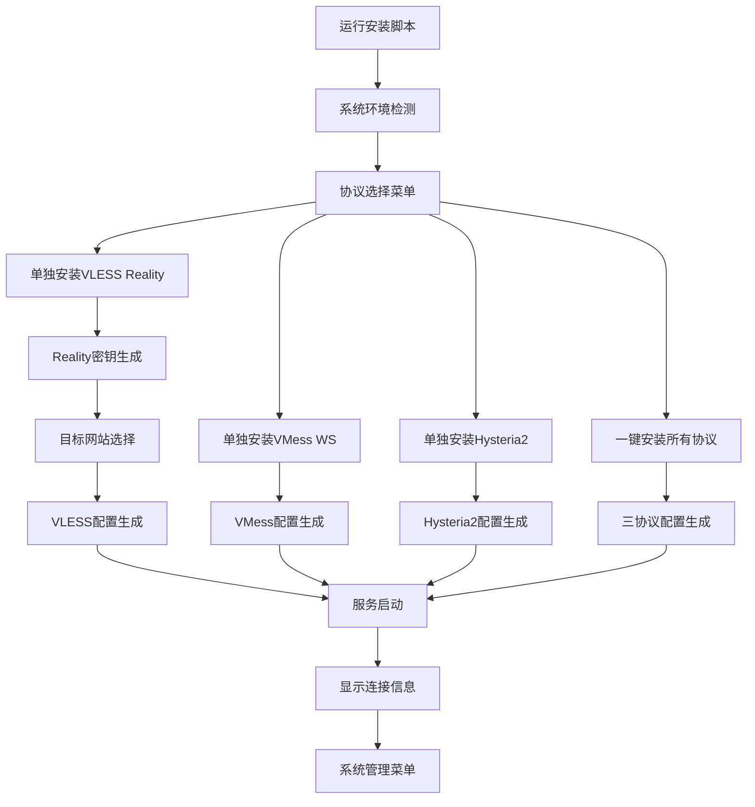

## 1. Product Overview
Sing-box VPS一键安装脚本优化版，基于fscarmen/sing-box项目的最佳实践进行改造，支持快速部署vless reality、vmess ws、hy2三种主流代理协议的自动化安装工具。
- 解决VPS代理服务器搭建复杂、配置繁琐的问题，通过代码优化和配置标准化提供更稳定可靠的一键部署方案。
- 目标是打造高质量、高稳定性的sing-box部署脚本，提升用户体验和系统可靠性，专注于核心功能实现。

## 2. Core Features

### 2.1 User Roles
| Role | Registration Method | Core Permissions |
|------|---------------------|------------------|
| VPS管理员 | 直接运行脚本 | 完整的安装、配置、管理权限 |

### 2.2 Feature Module
基于fscarmen/sing-box项目的优化方案，我们的sing-box安装脚本包含以下主要功能模块：
1. **主菜单页面**：协议选择、系统检测、安装状态显示、优化的用户界面
2. **安装配置页面**：自动安装sing-box、生成标准化配置文件、启动服务、错误处理增强
3. **协议管理页面**：vless reality配置、vmess ws配置、hy2配置、配置验证优化
4. **系统管理页面**：服务状态查看、日志查看、端口更改、配置分享、卸载功能
5. **代码优化模块**：函数重构、错误处理标准化、配置生成优化、兼容性增强

### 2.3 Page Details
| Page Name | Module Name | Feature description |
|-----------|-------------|---------------------|
| 主菜单页面 | 系统检测模块 | 检测操作系统类型、版本、网络环境，验证系统兼容性 |
| 主菜单页面 | 协议选择模块 | 提供vless reality、vmess ws、hy2三种协议选择界面，包含单独安装和一键安装选项 |
| 主菜单页面 | 状态显示模块 | 显示当前安装状态、服务运行状态、配置信息 |
| 安装配置页面 | 自动安装模块 | 下载最新版sing-box二进制文件、创建系统服务、配置开机自启 |
| 安装配置页面 | 配置生成模块 | 根据选择的协议自动生成对应的配置文件、设置监听端口 |
| 安装配置页面 | 证书管理模块 | 自动申请SSL证书、配置TLS、处理证书续期 |
| 协议管理页面 | VLESS Reality配置 | 配置reality参数、目标网站、私钥公钥生成、Short ID生成、Flow控制设置 |
| VLESS Reality专用页面 | Reality密钥生成模块 | 使用sing-box generate reality-keypair生成密钥对 |
| VLESS Reality专用页面 | 目标网站选择模块 | 提供microsoft.com、cloudflare.com等预设选项，支持自定义 |
| VLESS Reality专用页面 | 单独安装模块 | 独立的VLESS Reality安装流程，不依赖其他协议 |
| 协议管理页面 | VMess WS配置 | 配置websocket路径、UUID生成、伪装网站设置 |
| 协议管理页面 | Hysteria2配置 | 配置hy2端口、密码、混淆参数、带宽限制 |
| 系统管理页面 | 服务管理模块 | 启动停止重启服务、查看服务状态、设置开机自启 |
| 系统管理页面 | 日志查看模块 | 实时查看运行日志、错误日志、连接日志 |
| 系统管理页面 | 端口管理模块 | 修改监听端口、检测端口占用、自动重启服务应用新端口 |
| 系统管理页面 | 配置分享模块 | 生成客户端配置链接、二维码、订阅链接、批量导出 |
| 系统管理页面 | 卸载功能模块 | 完全卸载sing-box、清理配置文件、移除系统服务 |

## 3. Core Process
主要用户操作流程：
1. VPS管理员下载并运行安装脚本
2. 脚本自动检测系统环境和兼容性
3. 用户选择要安装的协议类型（单独安装vless reality/单独安装vmess ws/单独安装hy2/一键安装所有协议）
4. 脚本自动下载sing-box并进行安装配置
5. 根据选择的协议生成对应的配置文件
6. 启动服务并显示连接信息
7. 用户可通过管理菜单进行端口修改、配置分享等后续管理操作

VLESS Reality专用安装流程：
1. 选择"单独安装VLESS Reality"选项
2. 系统自动生成Reality密钥对（使用sing-box generate reality-keypair命令）
3. 用户选择目标网站（microsoft.com/cloudflare.com/自定义）
4. 自动生成Short ID（8位十六进制）
5. 配置Flow控制（xtls-rprx-vision）
6. 生成完整的VLESS Reality配置文件
7. 启动服务并显示包含Reality参数的连接信息

端口更改流程：
1. 进入系统管理菜单选择端口管理
2. 显示当前使用的端口信息
3. 输入新的端口号并验证可用性
4. 自动更新配置文件并重启服务
5. 验证新端口是否正常工作

配置分享流程：
1. 进入系统管理菜单选择配置分享
2. 选择要分享的协议配置
3. 生成客户端配置链接、二维码或订阅链接
4. 提供多种格式的配置导出选项



## 4. User Interface Design
### 4.1 Design Style
- 主色调：蓝色(#2196F3)和绿色(#4CAF50)，辅助色：灰色(#757575)
- 按钮样式：简洁的方形按钮，带有清晰的边框
- 字体：等宽字体，适合终端显示，字号适中便于阅读
- 布局风格：基于文本的菜单式界面，清晰的层级结构
- 图标风格：使用ASCII字符和简单符号，如[✓]、[✗]、[>]等

### 4.2 Page Design Overview
| Page Name | Module Name | UI Elements |
|-----------|-------------|-------------|
| 主菜单页面 | 系统检测模块 | 彩色状态指示器、系统信息表格、进度条显示 |
| 主菜单页面 | 协议选择模块 | 数字选项菜单、协议描述文本、推荐标签、单独安装选项 |
| 安装配置页面 | 安装进度模块 | 实时进度条、步骤状态显示、错误提示框 |
| 协议管理页面 | 配置显示模块 | 格式化的配置信息、二维码生成、复制提示 |
| VLESS Reality专用页面 | 密钥生成模块 | Reality密钥对显示、生成进度提示、密钥验证状态 |
| VLESS Reality专用页面 | 目标网站选择 | 预设网站列表、自定义输入框、连通性测试提示 |
| 系统管理页面 | 状态监控模块 | 实时状态刷新、彩色状态指示、操作按钮组 |
| 系统管理页面 | 端口管理模块 | 端口输入框、可用性检测提示、端口冲突警告 |
| 系统管理页面 | 配置分享模块 | 二维码显示区域、配置链接文本框、格式选择菜单 |

### 4.3 Responsiveness
该脚本主要面向服务器终端环境，采用文本界面设计，自适应不同终端窗口大小，支持SSH远程操作。

## 5. 基于fscarmen/sing-box的优化要求

### 5.1 代码质量优化

**代码结构优化：**
- 函数模块化重构，提高代码可读性和可维护性
- 统一错误处理机制，标准化错误信息输出
- 优化变量命名和代码注释，提升代码质量
- 移除冗余代码，简化复杂逻辑

**配置生成优化：**
- 标准化所有协议的配置文件格式
- 优化DNS配置，支持多DNS服务器和智能分流
- 完善路由规则，提升网络性能
- 统一TLS和证书处理逻辑

**兼容性增强：**
- 适配最新版本的sing-box
- 修复已知的配置兼容性问题
- 增强系统环境检测和适配
- 优化不同操作系统的支持

### 5.2 用户体验优化

**界面优化：**
- 改进菜单显示和交互逻辑
- 优化进度显示和状态反馈
- 增强错误提示和帮助信息
- 统一颜色方案和视觉效果

**安装流程优化：**
- 简化安装步骤，减少用户输入
- 优化默认配置选择
- 增强安装过程的稳定性
- 改进安装失败的恢复机制

### 5.3 配置文件修复要求

**核心问题修复：**

**问题1：缺少代理出口（Outbounds）配置**
- 当前配置只有direct（直连）和block（拦截）两个出口选项
- 必须添加实际的代理服务器配置（VMess、VLESS等类型的出口）
- sing-box需要通过这些出口将数据包转发到代理服务器

**问题2：路由规则（Route）错误**
- 当前"final": "direct"导致所有流量直接连接互联网
- 需要修改为通过代理服务器转发流量
- 路由规则应该将需要代理的流量指向代理出口

**修复方案：**
- 参照sing-box官方文档标准配置
- 添加完整的outbounds代理配置
- 修正路由规则，确保流量正确转发
- 实现客户端到代理服务器的完整链路

### 5.4 技术实现细节

**VLESS Reality协议优化：**

**必需函数：**
- `install_vless_reality()` - VLESS Reality单独安装函数
- `generate_vless_reality_config()` - VLESS Reality配置生成函数
- `generate_reality_keypair()` - Reality密钥对生成函数
- `select_target_website()` - 目标网站选择函数

**配置参数要求：**
- **协议类型**: "vless"
- **传输方式**: "tcp"
- **Flow控制**: "xtls-rprx-vision"
- **TLS类型**: "reality"
- **密钥对**: 使用`sing-box generate reality-keypair`命令生成
- **Short ID**: 8位十六进制随机字符串
- **目标网站**: 预设microsoft.com、cloudflare.com，支持自定义
- **服务器名称**: 与目标网站一致

**修复后的标准化配置结构：**
```json
{
  "log": {
    "level": "info",
    "output": "/var/log/sing-box/sing-box.log",
    "timestamp": true
  },
  "dns": {
    "servers": [
      {
        "tag": "cloudflare",
        "address": "https://1.1.1.1/dns-query",
        "detour": "direct"
      },
      {
        "tag": "google", 
        "address": "https://8.8.8.8/dns-query",
        "detour": "direct"
      }
    ],
    "final": "cloudflare",
    "strategy": "prefer_ipv4"
  },
  "inbounds": [{
    "type": "vless",
    "listen_port": 443,
    "sniff": true,
    "sniff_override_destination": true,
    "domain_strategy": "ipv4_only",
    "users": [{
      "uuid": "生成的UUID",
      "flow": "xtls-rprx-vision"
    }],
    "tls": {
      "enabled": true,
      "reality": {
        "enabled": true,
        "handshake": {
          "server": "microsoft.com",
          "server_port": 443
        },
        "private_key": "生成的私钥",
        "short_id": ["生成的短ID"]
      }
    }
  }],
  "outbounds": [
    {
      "tag": "proxy",
      "type": "vless",
      "server": "代理服务器地址",
      "server_port": 443,
      "uuid": "生成的UUID",
      "flow": "xtls-rprx-vision",
      "tls": {
        "enabled": true,
        "reality": {
          "enabled": true,
          "public_key": "生成的公钥",
          "short_id": "生成的短ID"
        }
      }
    },
    {
      "tag": "direct",
      "type": "direct"
    },
    {
      "tag": "block",
      "type": "block"
    }
  ],
  "route": {
    "rules": [
      {
        "ip_is_private": true,
        "outbound": "direct"
      },
      {
        "domain_suffix": [".cn"],
        "outbound": "direct"
      }
    ],
    "final": "proxy",
    "auto_detect_interface": true
  },
  "experimental": {
    "cache_file": {
      "enabled": true
    },
    "clash_api": {
      "external_controller": "127.0.0.1:9090"
    }
  }
}
```

**关键修复点说明：**
1. **添加outbounds配置**：包含proxy（代理出口）、direct（直连）、block（拦截）三种出口
2. **修正路由规则**：将"final": "direct"改为"final": "proxy"，确保默认流量通过代理
3. **完善代理链路**：客户端 → inbounds → route → outbounds → 代理服务器
4. **保留直连规则**：私有IP和中国域名仍然直连，其他流量走代理

### 5.5 配置文件生成函数要求

**核心配置生成函数：**
- `generate_complete_config()` - 生成包含完整outbounds的配置文件
- `validate_config_structure()` - 验证配置文件结构完整性
- `fix_route_rules()` - 修复路由规则，确保流量正确转发
- `add_proxy_outbounds()` - 添加代理出口配置

**配置验证要求：**
- 检查outbounds是否包含代理配置
- 验证路由规则final指向是否正确
- 确保inbounds和outbounds配置匹配
- 测试配置文件语法正确性

### 5.6 主菜单更新要求

**新增菜单选项：**
- 未安装状态：
  - "1. 单独安装VLESS Reality"
  - "2. 单独安装VMess WebSocket"
  - "3. 单独安装Hysteria2"
  - "4. 一键安装所有协议 (VLESS Reality + VMess WS + Hysteria2)"

**一键安装功能更新：**
- 必须包含VLESS Reality、VMess WebSocket、Hysteria2三种协议
- 自动分配不冲突的端口
- 生成三套完整的配置参数
- 显示所有协议的连接信息

### 5.4 优化实施计划

**阶段1：代码质量提升**
- 重构核心配置生成函数
- 统一错误处理和日志记录
- 优化变量命名和代码结构
- 移除冗余和过时的代码

**阶段2：配置标准化**
- 更新所有协议配置模板
- 统一DNS和路由配置
- 优化TLS和证书处理
- 增强配置验证机制

**阶段3：用户体验改进**
- 优化菜单界面和交互流程
- 改进错误提示和帮助信息
- 增强安装过程的稳定性
- 完善状态显示和进度反馈

**阶段4：兼容性和稳定性**
- 适配最新版本sing-box
- 修复已知兼容性问题
- 增强系统环境适配
- 完善测试和验证机制

### 5.5 验收标准

**功能完整性：**
- 保持现有VMess WebSocket和Hysteria2功能不变
- 新增功能不影响现有配置和服务
- 支持单协议和多协议配置的无缝切换
- 配置分享功能需支持所有协议链接生成

**代码质量：**
- 代码通过语法检查和静态分析
- 函数模块化程度显著提升
- 错误处理机制统一且完善
- 代码注释和文档完整

**用户体验：**
- 安装成功率达到95%以上
- 错误信息清晰易懂
- 界面交互流畅自然
- 配置生成准确无误

**兼容性：**
- 支持主流Linux发行版
- 适配最新版本sing-box
- 配置文件格式标准化
- 向后兼容现有配置