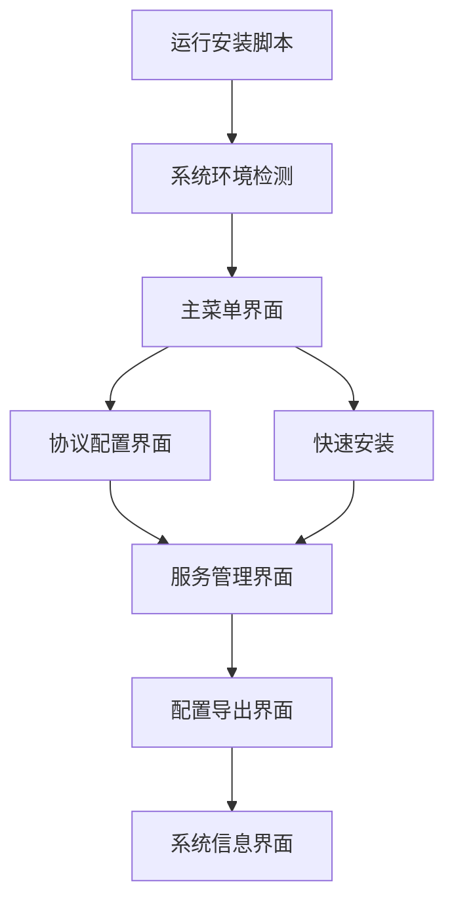

# Sing-box 一键安装脚本产品需求文档

## 1. 产品概述

本项目旨在开发一个自动化的sing-box安装和配置脚本，为用户提供简单易用的一键部署解决方案。
脚本支持三种主流代理协议：VLESS Reality、VMess WebSocket和Hysteria2，满足不同网络环境和性能需求。
目标是降低sing-box部署门槛，让普通用户也能快速搭建高性能的代理服务。

## 2. 核心功能

### 2.1 用户角色

| 角色 | 使用方式 | 核心权限 |
|------|----------|----------|
| 服务器管理员 | 直接运行脚本 | 可安装配置所有协议，管理服务状态 |
| 普通用户 | 获取配置信息 | 可查看连接配置，导出客户端配置 |

### 2.2 功能模块

脚本需求包含以下主要功能页面：
1. **主菜单界面**：协议选择、系统检测、快速安装选项
2. **协议配置界面**：VLESS Reality配置、VMess WS配置、Hysteria2配置
3. **服务管理界面**：启动停止服务、查看运行状态、重启服务
4. **配置导出界面**：生成客户端配置、二维码生成、配置文件下载
5. **系统信息界面**：服务器信息显示、网络状态检测、性能监控

### 2.3 页面详情

| 页面名称 | 模块名称 | 功能描述 |
|----------|----------|----------|
| 主菜单界面 | 协议选择模块 | 显示三种协议选项，支持单选或多选安装 |
| 主菜单界面 | 系统检测模块 | 自动检测操作系统、网络环境、端口占用情况 |
| 主菜单界面 | 快速安装模块 | 一键安装默认配置，适合新手用户 |
| 协议配置界面 | VLESS Reality配置 | 设置域名、端口、UUID、私钥等参数 |
| 协议配置界面 | VMess WS配置 | 配置端口、UUID、路径、TLS证书等 |
| 协议配置界面 | Hysteria2配置 | 设置端口、密码、证书、混淆参数 |
| 服务管理界面 | 服务控制模块 | 启动、停止、重启sing-box服务 |
| 服务管理界面 | 状态监控模块 | 实时显示服务运行状态、连接数、流量统计 |
| 配置导出界面 | 配置生成模块 | 自动生成各平台客户端配置文件 |
| 配置导出界面 | 二维码模块 | 生成配置二维码，方便移动端扫码导入 |
| 系统信息界面 | 服务器信息模块 | 显示CPU、内存、磁盘、网络等系统信息 |
| 系统信息界面 | 网络检测模块 | 测试网络连通性、延迟、带宽等指标 |

## 3. 核心流程

**管理员安装流程：**
用户运行脚本 → 系统环境检测 → 选择协议类型 → 配置协议参数 → 自动安装sing-box → 生成配置文件 → 启动服务 → 显示连接信息

**普通用户使用流程：**
访问管理界面 → 查看服务状态 → 获取客户端配置 → 下载配置文件或扫描二维码

## 4. 用户界面设计

### 4.1 设计风格

- **主色调**：深蓝色 (#1e3a8a) 和青色 (#06b6d4)
- **辅助色**：绿色 (#10b981) 表示成功，红色 (#ef4444) 表示错误，黄色 (#f59e0b) 表示警告
- **按钮样式**：圆角矩形，带有渐变效果和悬停动画
- **字体**：等宽字体用于代码和配置，无衬线字体用于界面文本
- **布局风格**：命令行界面风格，使用ASCII艺术字和表格布局
- **图标样式**：使用ASCII字符和Unicode符号，保持终端兼容性

### 4.2 页面设计概览

| 页面名称 | 模块名称 | UI元素 |
|----------|----------|--------|
| 主菜单界面 | 协议选择模块 | 数字选项菜单，彩色协议图标，选择状态指示器 |
| 主菜单界面 | 系统检测模块 | 进度条，检测结果表格，状态指示灯 |
| 协议配置界面 | 参数输入模块 | 交互式表单，实时验证，帮助提示 |
| 服务管理界面 | 控制面板 | 按钮组，状态面板，日志滚动显示 |
| 配置导出界面 | 配置展示 | 代码块，复制按钮，二维码ASCII艺术 |
| 系统信息界面 | 信息面板 | 表格布局，进度条，实时更新数据 |

### 4.3 响应式设计

脚本主要运行在服务器终端环境，需要适配不同终端窗口大小，支持最小80x24字符的终端显示。